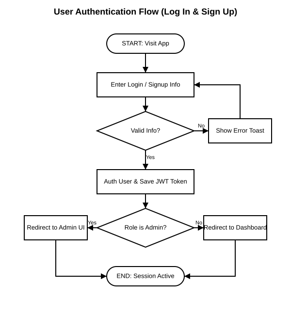
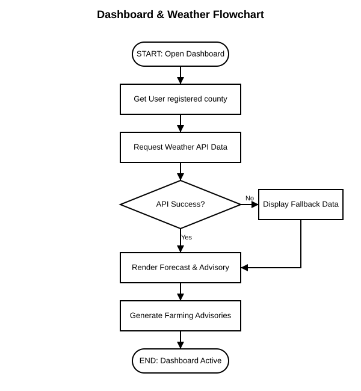
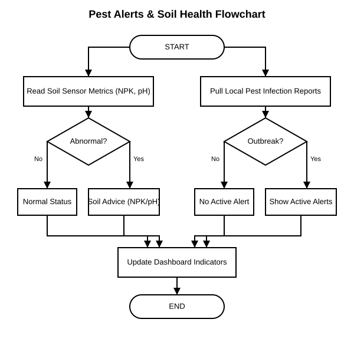
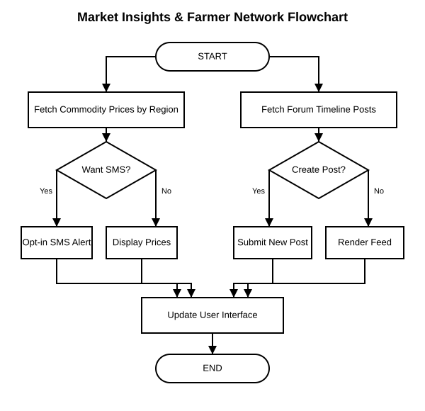
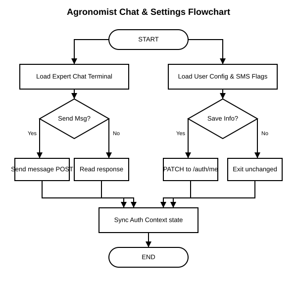

# Climate Smart Farming - Flowcharts & Module Guides

This directory contains simple, clean, vector-based flowcharts (with clean white backgrounds) for all the modules in the Climate Smart Farming application. You can access the actual image files directly in the same folder: `docs/`.

---

## 1. Authentication Flowchart (Log In & Sign Up)
Guides the user through account creation (Sign Up) and verification (Log In).

*   **Image File**: [docs/auth_flow.svg](auth_flow.svg)
*   **Description**: Shows frontend form validation, submitting credentials, backend database registration/validation, password hashing, and navigation redirection based on roles.

---

## 2. Dashboard & Weather Forecast Flowchart
Illustrates how weather forecasting data is fetched and displayed to the farmer.

*   **Image File**: [docs/weather_dashboard_flow.svg](weather_dashboard_flow.svg)
*   **Description**: Shows geolocation fetching, requesting meteorological forecasts from the API, rendering daily and weekly forecasts, and triggering crop planting recommendations.

---

## 3. Pest Alerts & Soil Health Flowchart
Maps out how local soil sensor metrics and pest outbreaks are monitored.

*   **Image File**: [docs/pests_soil_flow.svg](pests_soil_flow.svg)
*   **Description**: Explains checking NPK (Nitrogen, Phosphorus, Potassium), pH, and moisture levels, generating fertilization tips, reporting pest outbreaks, and sending warnings to community maps.

---

## 4. Market Insights & Farmer Network Flowchart
Flowchart mapping out crop pricing lookups and community forums.

*   **Image File**: [docs/market_network_flow.svg](market_network_flow.svg)
*   **Description**: Details how commodity crop prices are collected across markets, the process of registering for SMS notifications, and how farmers publish or read messages in the network forum.

---

## 5. Agronomist Chat & Settings Flowchart
Shows how farmers chat with expert agronomists and customize their preferences.

*   **Image File**: [docs/chat_settings_flow.svg](chat_settings_flow.svg)
*   **Description**: Illustrates real-time question submissions from farmers, agronomist response dashboards, profiling configuration, and toggling of SMS alerting services.

